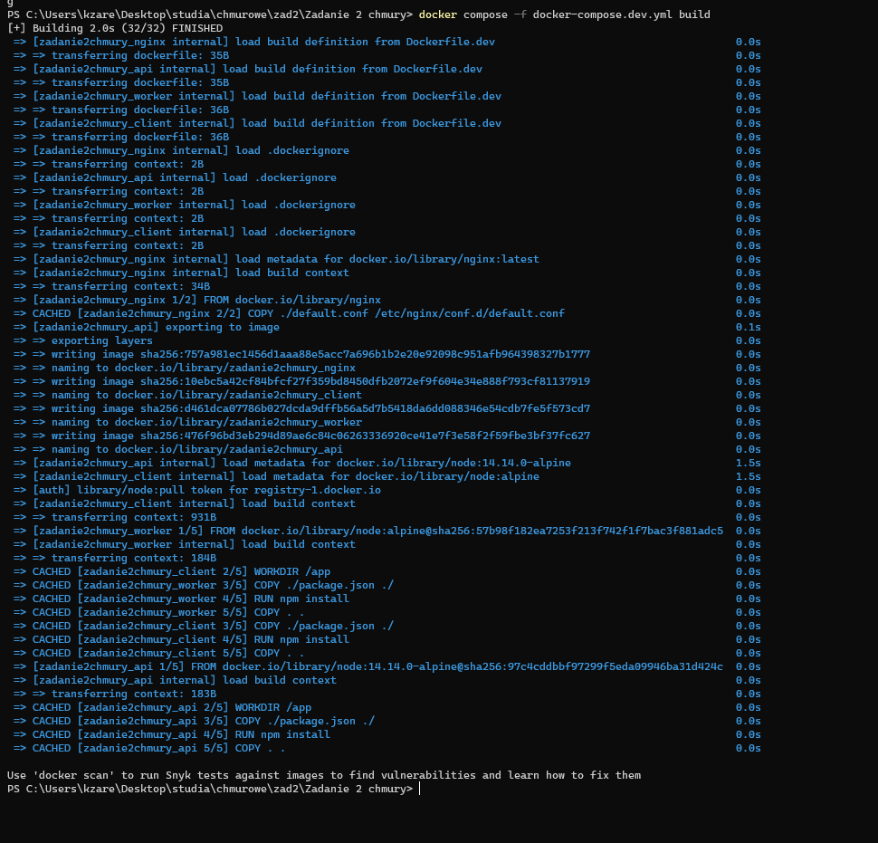
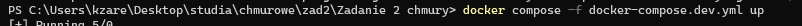
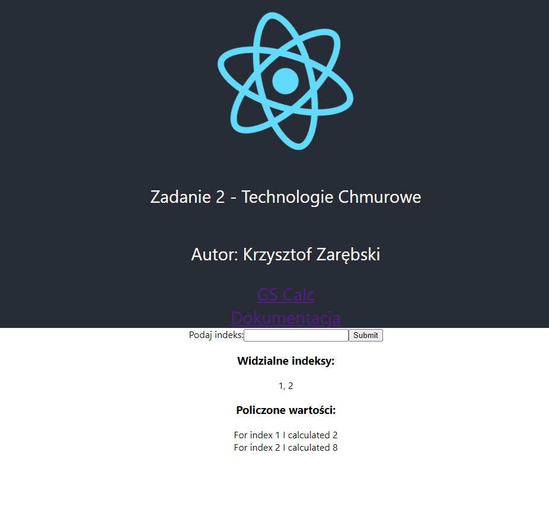

# README dla wrsji dev

## Budowanie obrazów

Do zbudowania  należy wykorzystać narzędzie docker-compose z plikiem wersji dev - plik docker-compose.dev.yml:

## Odpalenie usługi

Do uruchomienia usłgi należy użyć komendy **docker compose -f docker-compose.dev.yml up**

## Uruchomiona usługa

