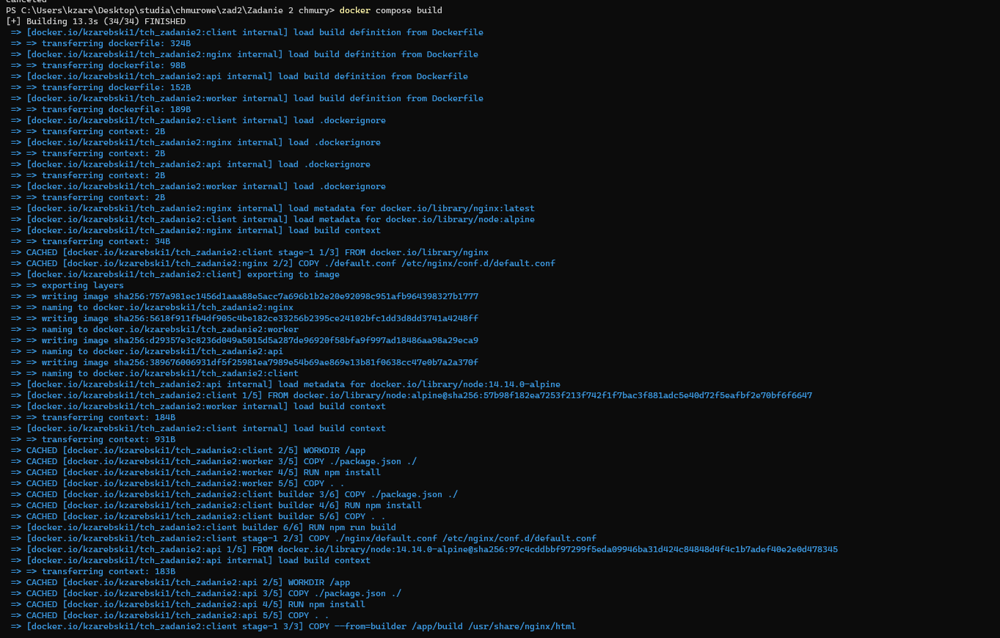
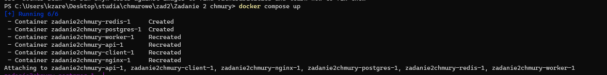
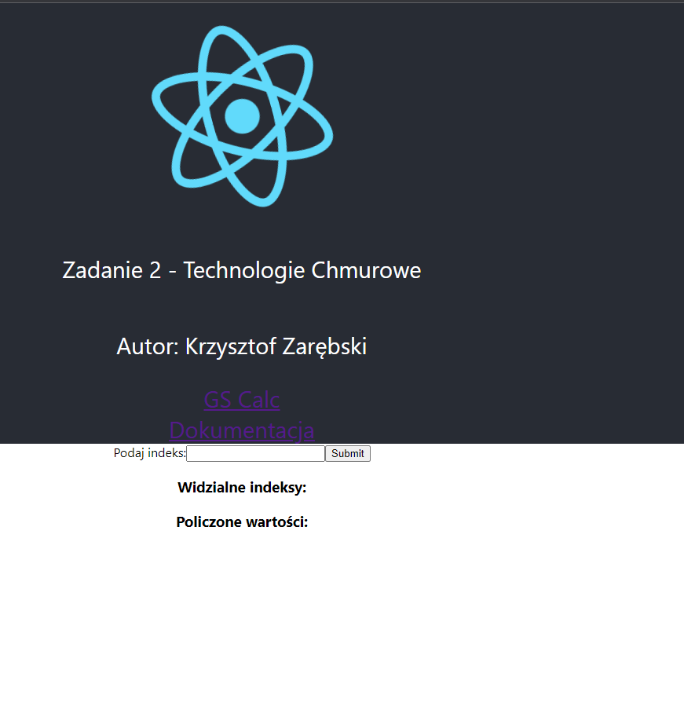

# README dla wersji produkcyjnej

## Konfiguracja repozytorium

Konieczne jest0skonfigurowanie repozytorium za pomocą zmiennych środowiskowych. Do skorzystania z nich należy użyć następującej konfiguracji:

## Budowanie obrazów

Do zbudowania obrazów należy wykorzystać narzędzie docker-compose z plikiem wersji produkcyjnej  docker-compose.yml i polecenia **docker compose build**:

## Uruchomienie usługi

DO uruchomienia usługi w wersji produkcyjnej należy użyć polecenia **docker compose up**:

## Usługa działa

W wersji produkcyjnej client korzysta z serwera nginx.
