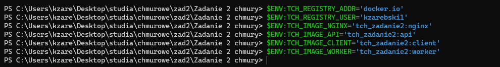

# README  dla wersji stack, swarm

## Konfiguracja repozytorium

Należy ustawić odpowiednie zmienne środowiskowe, polecenie **docker stack** nie wczytuje zmiennych środowiskowych z plików `.env`. Konieczne jest wykorzystanie funkcjonalność używanej powłoki `$ENV:[nazwa]` w PowerShell. Do wczytania konfiguracji z pliku, możemy wykorzystać polecenie `env` - aby ustawić dla całej bieżącej sesji powłoki:

Wersja stack / swarm wymaga ustawienia zmiennej środowiskowej TCH_REPLICAS - oznaczającą ilość replik każdego z poszczególnych kontenerów.

## Inicjalizacja klastra

Należy użyć polecenia docker swarm init

## Uruchomienie usługi

Do uruchomienia należy wykorzystać narzędzie docker stack z plikiem wersji stack / swarm - `docker-swarm.yml`:

## Konfiguracja dla sekcji deploy

Dla uproszczenia konfiguracji ilość replik każdego z kontenerów jest ustawiana za pomocą jednej zmiennej środowiskowej.

Kontener postgres nie jest replikowany z tego powodu, iż jest to baza danych. Aby był dostępny z każdej kopii każdego kontenera, trzeba wykorzystać warunek  uruchomienia na węźle pełniącym funkcję menadżera.

## Działanie programu

